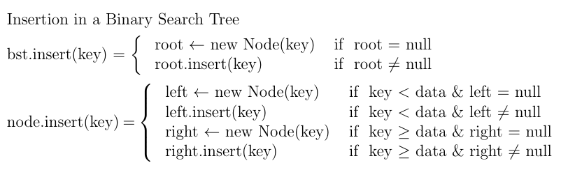

# Binary Search Tree Implementation Step-by-Step

We use recursion to implement the operations. Recursive programs are simple, elegant and intuitive. While implementing the operations using iteration can be a very good programming exercise, it is not advised as it can render the program difficult to read/grasp.

**Note**: Recursion in object-oriented programming should exercise delegation of responsibilities from BST to root which in turn to its left or right, so on and so forth. For example, it is advised to avoid implementing **insert(root,key)** and rather implement as **root.insert(key)**.

Let us now define a BSTNode and BST which contains root which is of BSTNode type.

## 1. Defining a BSTNode and BST

``` java
// BSTNode.java

public class BSTNode {
    protected int data;
    protected BSTNode left;
    protected BSTNode right;

    public BSTNode() { };
    public BSTNode(int d) {
        data = d;
    }
}
```

``` java
// BST.java

public class BST {
    protected BSTNode root;
}
```

``` java
// BSTDriver.java

public class BSTDriver {
    public static void main(String[] args) {
        BST b = new BST();
        b.root = new BSTNode(50);
        System.out.println(b.root.data);  // prints 50
    }
}
```

## 2. Defining insert operation

Before we can do any search on a BST, we have to insert some keys into it. Let's implement insert operation. The insert operation is implemented as follows.

 - The test driver invokes insert on BST instance.
 - The BST instance creates root if it is not present. Otherwise, it invokes insert on root (i.e. delegates the insert responsibility to the root).
 - The root checks if the the key needs to inserted to its left or right. If it is not empty, root recursively delegates to its left or right.
 

              
``` java
// BSTNode.java

public class BSTNode {
    protected int data;
    protected BSTNode left;
    protected BSTNode right;

    public BSTNode() { };
    public BSTNode(int d) { ...  }
    
    public void insert(int key) {
        // Two cases - decide left or right
        if (key < data)  { // 1. go leftwards
            // Two sub cases - left slot is empty or not
            if (left == null)  // left is available for insertion
                left = new BSTNode(key);
            else  // left is not available, so delegate insert to left child
                left.insert(key);
        }
        else {  // 2. go rightwards
            // Two sub cases - right slot is empty or not
            if (right == null)  // right is available for insertion
                right = new BSTNode(key);
            else  // right is not available, so delegate insert to right child
                right.insert(key);
        }
    }
}
```

``` java
// BST.java

public class BST {
    protected BSTNode root;
    
    public void insert(int key) {
        if (root == null)
            root = new BSTNode(key);
        else
            root.insert(key);
    }
}
```

``` java
// BSTDriver.java

public class BSTDriver {
    public static void main(String[] args) {
        BST b = new BST();
        b.insert(50);
        b.insert(20);
	b.insert(80);
        b.insert(10);
        b.insert(30);
        b.insert(5);
	b.insert(15);
	b.insert(25);
        b.insert(35);
        b.insert(70);
        b.insert(90);
        b.insert(65);
        b.insert(75);
        b.insert(85);
        b.insert(95);
    }
}

/*
                  -----------------50-----------------
                  |                                  |
          -------20------                   --------80--------
          |             |                   |                |
    -----10----     ----30----         -----70----      -----90-----
    |         |     |        |         |         |      |          |
    5        15    25        35       65         75     85         95

*/
```

## 3. Defining search operation

The primary purpose of binary search tree is that it allows searching a key in O(log n) time. Again, the implementation is recursive and applies the principle of delegation.

  - If BST does not contain any node (i.e. root is null), no search can be done. Therefore, return false.
  - Otherwise, delegate the search responsibility to root. 
  - The root checks if key matches it data, if so, it returns true.
  - Otherwise, based on the key value, it delegates the search to its left or its right,provided left or right exists.
  - This process continues until either key matches a data or no match is found and leaf is reached.

``` java
// BSTNode.java

public class BSTNode {
    protected int data;
    protected BSTNode left;
    protected BSTNode right;

    public BSTNode() { };
    public BSTNode(int d) { ... }
    public void insert(int key) { ... }
    
    public boolean search(int key) {
        if (key == data)
            return true;
        else if (key < data && left != null)
            return left.search(key);
        else if (key > data && right != null)
            return right.search(key);
        else
            return false;
    }
}
```

``` java
// BST.java

public class BST {
    protected BSTNode root;
    
    public void insert(int key) { ... }
    
    public boolean search(int key) {
        if (root == null)
            return false;
        else
            return root.search(key);
    }
}
```

``` java
// BSTDriver.java

public class BSTDriver {
    public static void main(String[] args) {
        BST b = new BST();
	
	int[] arr = {50, 20, 80, 10, 30, 5, 15, 25, 35, 70, 90, 65,75, 85, 95};
	for (int i=0; i< arr.length; i++)
	    b.insert(arr[i]);
	    
	System.out.println( b.search(43) );  // prints false
        System.out.println( b.search(70) );  // prints true
    }
}
```

## 4. Defining inorder, preorder, postorder traversals

Traversal is an essential part of every data structure. But unlike linked list, traversing in a tree is not straightforward due to its non-linearity. Since every node in a binary search tree (or any binary tree for that matter) has at most two children, two paths are possible. In order to traverse the entire tree, a systematic mechanism is necessary. Four types of traversals are common: level order, inorder, preorder and postorder. The first one will be looked at in the next section. 

``` java
// BSTNode.java

public class BSTNode {
    protected int data;
    protected BSTNode left;
    protected BSTNode right;

    public BSTNode() { };
    public BSTNode(int d) { ... }
    public void insert(int key) { ... }
    public boolean search(int key) { ... }
    
    public void inorder() {
        // Inorder traversal - traverse left, visit this, traverse right
        if (left != null)  // traverse leftwards only if left subtree exists
            left.inorder();
        System.out.print(data + " ");
        if (right != null)  // traverse rightwards only if right subtree exists
            right.inorder();
    }

    public void preorder() {
        // Preorder traversal - visit this, traverse left, traverse right

	// Implement your logic here


    }

    public void postorder() {
        // Postorder traversal - traverse left, traverse right, visit this


	// Implement your logic here

    }    
}
```

``` java
// BST.java

public class BST {
    protected BSTNode root;
    
    public void insert(int key) { ... }    
    public boolean search(int key) { ... }
    
    public void inorder() {
        if (root == null)
            return;
        else
            root.inorder(key);
    }
    
    public void preorder() {
    	// Implement your logic here
    
    
    }
    
    public void postorder() {
    	// Implement your logic here
    
    
    
    }
}
```

``` java
// BSTDriver.java

public class BSTDriver {
    public static void main(String[] args) {
        BST b = new BST();
	
	int[] arr = {50, 20, 80, 10, 30, 5, 15, 25, 35, 70, 90, 65,75, 85, 95};
	for (int i=0; i< arr.length; i++)
	    b.insert(arr[i]);
	    
	System.out.println( b.search(43) );  // prints false
        System.out.println( b.search(70) );  // prints true
	b.inorder();  // prints 5 10 15 20 25 30 35 50 65 70 75 80 85 90 95
	b.preorder(); // prints 50 20 10 5 15 30 25 35 80 70 65 75 90 85 95
	b.postorder(); // prints 5 15 10 25 35 30 20 65 75 70 85 95 90 80 50
    }
}
```

## 5. Defining level-order traversal

Level order traversal visits the nodes in a top-to-bottom, left-to-right manner. Owing to its unconventional way of traversing the tree, recursion does not suit well. To achieve, level order traversal, a queue is necessary. We make use of **ArrayDeque** from Java Collections library.

``` java
// BSTNode.java -- no changes, remains same as before

```

``` java
// BST.java

import java.util.ArrayDeque;

public class BST {
    protected BSTNode root;
    
    public void insert(int key) { ... }    
    public boolean search(int key) { ... }
    public void inorder() { ... }
    public void preorder() { ... }
    public void postorder() { ... }
    
    public void levelorder() {
	ArrayDeque<BSTNode> deq = new ArrayDeque<BSTNode>();
	deq.addLast(root);

	while ( !deq.isEmpty() ) { // until queue is not empty
	    BSTNode n = deq.removeFirst();
	    System.out.print(n.data + " ");
	    if (n.left != null)
		deq.addLast(n.left);
	    if (n.right != null)
		deq.addLast(n.right);
	}
	System.out.println();
    }
}
```

``` java
// BSTDriver.java

public class BSTDriver {
    public static void main(String[] args) {
        BST b = new BST();
	
	int[] arr = {50, 20, 80, 10, 30, 5, 15, 25, 35, 70, 90, 65,75, 85, 95};
	for (int i=0; i< arr.length; i++)
	    b.insert(arr[i]);
	    
	System.out.println( b.search(43) );  // prints false
        System.out.println( b.search(70) );  // prints true
	b.inorder();  // prints 5 10 15 20 25 30 35 50 65 70 75 80 85 90 95
	b.preorder(); // prints 50 20 10 5 15 30 25 35 80 70 65 75 90 85 95
	b.postorder(); // prints 5 15 10 25 35 30 20 65 75 70 85 95 90 80 50
	b.levelorder(); // prints 50 20 80 10 30 70 90 5 15 25 35 65 75 85 95 
    }
}
```

## 6. Deleting Leaf Node

**High level deletion strategy**: In order to delete a node, the parent of the to-be-deleted node must reassign the links. Therefore, for the parent to be in control, searching if data matches key is performed on left and right from the parent. If there is match, then links can be reassigned.

If the to-be-deleted node is a leaf, the parent of the to-be-deleted node reassigns its link - left or right as the case may be - to null. In order to navigate to the to-be-deleted leaf node, recursion is used.

``` java
// BSTNode.java

public class BSTNode {
    protected int data;
    protected BSTNode left;
    protected BSTNode right;

    public BSTNode() { };
    public BSTNode(int d) { ...  }    
    public void insert(int key) { ... }
    public boolean search(int key) { ... }    
    public void inorder() { ... }
    public void preorder() { ... }
    public void postorder() { ... }
    
    public void delete(int key) {
    
    
    }
```

``` java
// BST.java

import java.util.ArrayDeque;

public class BST {
    protected BSTNode root;
    
    public void insert(int key) { ... }    
    public boolean search(int key) { ... }
    public void inorder() { ... }
    public void preorder() { ... }
    public void postorder() { ... }    
    public void levelorder() { ... }
    
    public void delete(int key) {
    
    }
}
```

``` java
// BSTDriver.java

public class BSTDriver {
    public static void main(String[] args) {
        BST b = new BST();
	
	int[] arr = {50, 20, 80, 10, 30, 5, 15, 25, 35, 70, 90, 65,75, 85, 95};
	for (int i=0; i< arr.length; i++)
	    b.insert(arr[i]);
	    
	b.inorder();  // prints 5 10 15 20 25 30 35 50 65 70 75 80 85 90 95
	b.delete(15); // 15 is a leaf node
	b.inorder();  // prints 5 10 20 25 30 35 50 65 70 75 80 85 90 95
    }
}
```

## 7. Deleting a Node that has either Left or Right (not both)

``` java
// BSTNode.java

public class BSTNode {
    protected int data;
    protected BSTNode left;
    protected BSTNode right;

    public BSTNode() { };
    public BSTNode(int d) { ... }    
    public void insert(int key) { ... }
    public boolean search(int key) { ... }    
    public void inorder() { ... }
    public void preorder() { ... }
    public void postorder() { ... }
    
    public void delete(int key) {
    
    
    }
```

``` java
// BST.java

import java.util.ArrayDeque;

public class BST {
    protected BSTNode root;
    
    public void insert(int key) { ... }    
    public boolean search(int key) { ... }
    public void inorder() { ... }
    public void preorder() { ... }
    public void postorder() { ... }    
    public void levelorder() { ... }
    
    public void delete(int key) {
    
    }
}
```

``` java
// BSTDriver.java

public class BSTDriver {
    public static void main(String[] args) {
        BST b = new BST();
	
	int[] arr = {50, 20, 80, 10, 30, 5, 15, 25, 35, 70, 90, 65,75, 85, 95};
	for (int i=0; i< arr.length; i++)
	    b.insert(arr[i]);
	    
	b.inorder();  // prints 5 10 15 20 25 30 35 50 65 70 75 80 85 90 95
	b.delete(15); // 15 is a leaf node
	b.inorder();  // prints 5 10 20 25 30 35 50 65 70 75 80 85 90 95
    }
}
```

## 8. Deleting a Node that has both Left and Right

``` java
// BSTNode.java

public class BSTNode {
    protected int data;
    protected BSTNode left;
    protected BSTNode right;

    public BSTNode() { };
    public BSTNode(int d) { ... }
    
    public void insert(int key) { ... }
    public boolean search(int key) { ... }    
    public void inorder() { ... }
    public void preorder() { ... }
    public void postorder() { ... }
    
    public void delete(int key) {
    
    
    }
```

``` java
// BST.java

import java.util.ArrayDeque;

public class BST {
    protected BSTNode root;
    
    public void insert(int key) { ... }    
    public boolean search(int key) { ... }
    public void inorder() { ... }
    public void preorder() { ... }
    public void postorder() { ... }    
    public void levelorder() { ... }
    
    public void delete(int key) {
    
    }
}
```

``` java
// BSTDriver.java

public class BSTDriver {
    public static void main(String[] args) {
        BST b = new BST();
	
	int[] arr = {50, 20, 80, 10, 30, 5, 15, 25, 35, 70, 90, 65,75, 85, 95};
	for (int i=0; i< arr.length; i++)
	    b.insert(arr[i]);
	    
	b.inorder();  // prints 5 10 15 20 25 30 35 50 65 70 75 80 85 90 95
	b.delete(15); // 15 is a leaf node
	b.inorder();  // prints 5 10 20 25 30 35 50 65 70 75 80 85 90 95
    }
}
```

## 9. Deleting Root

``` java
// BSTNode.java

public class BSTNode {
    protected int data;
    protected BSTNode left;
    protected BSTNode right;

    public BSTNode() { };
    public BSTNode(int d) { ...  }
    
    public void insert(int key) { ... }
    public boolean search(int key) { ... }    
    public void inorder() { ... }
    public void preorder() { ... }
    public void postorder() { ... }
    
    public void delete(int key) {
    
    
    }
```

``` java
// BST.java

import java.util.ArrayDeque;

public class BST {
    protected BSTNode root;
    
    public void insert(int key) { ... }    
    public boolean search(int key) { ... }
    public void inorder() { ... }
    public void preorder() { ... }
    public void postorder() { ... }    
    public void levelorder() { ... }
    
    public void delete(int key) {
    
    }
}
```

``` java
// BSTDriver.java

public class BSTDriver {
    public static void main(String[] args) {
        BST b = new BST();
	
	int[] arr = {50, 20, 80, 10, 30, 5, 15, 25, 35, 70, 90, 65,75, 85, 95};
	for (int i=0; i< arr.length; i++)
	    b.insert(arr[i]);
	    
	b.inorder();  // prints 5 10 15 20 25 30 35 50 65 70 75 80 85 90 95
	b.delete(15); // 15 is a leaf node
	b.inorder();  // prints 5 10 20 25 30 35 50 65 70 75 80 85 90 95
    }
}
```

## 10. Compute height of the tree

``` java
// BSTNODE.java

public class BSTNode {
    protected int data;
    protected BSTNode left;
    protected BSTNode right;

    public BSTNode() { };
    public BSTNode(int d) { ...  }
    
    public void insert(int key) { ... }
    public boolean search(int key) { ... }    
    public void inorder() { ... }
    public void preorder() { ... }
    public void postorder() { ... }
    public void delete(int key) { ... }

    public int height() {
    	if ( isLeaf() )
    		return 0;
    	else if (hasOnlyLeft()) 
    		return left.height() + 1;
    	else if (hasOnlyRight())
    		return right.height() + 1;
	else
    		return max(left.height(), right.height()) + 1;
    }

    public int max(int a, int b) {
    	if (a > b)
    		return a;
    	else
    		return b;
    }
}
```

``` java
// BST.java

public class BST {
    protected BSTNode root;
    
    public void insert(int key) { ... }    
    public boolean search(int key) { ... }
    public void inorder() { ... }
    public void preorder() { ... }
    public void postorder() { ... }    
    public void levelorder() { ... }
    public void delete(int key) { ... }

    public int height() {
	if (root == null)
	    return 0;
	else
	    return root.height();
    }
}
```

The complete code for BST can be accessed from [BST Implementation](src/BST.java).
