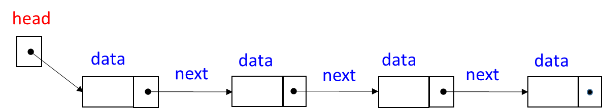
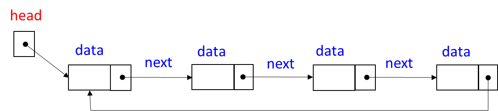
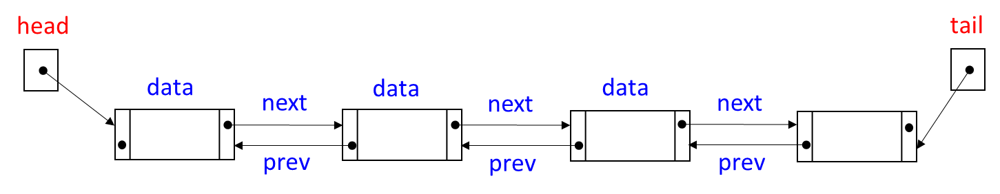
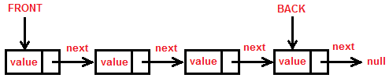
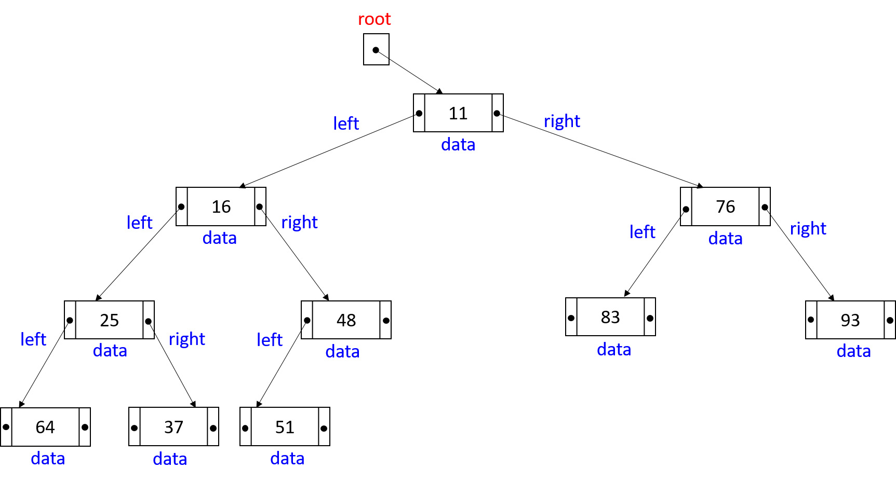
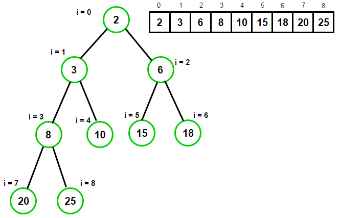
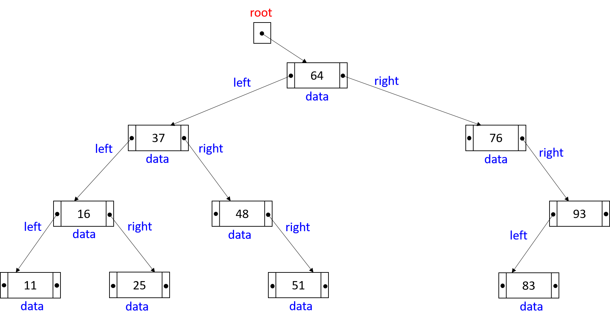

## 1. Linked List

### Limitations of arrays
  - size is static and bounded, dynamic resizing not possible
  - insert requires shifting out subsequent elements to right
  - delete requires shifting out subsequent elements to left

### What is a linked list?
  - A data structure that holds a pointer **head** to a chained link of nodes.
  - Each node contains 2 parts:
    1. **data**: holds the data
    2. **next**: holds link to the next node

### Visualizing linked list


### Properties of linked list
  - No random access.
  - To reach a node, always start from the head and traverse.

### Operations on linked list
  - insert
  - delete
  - search

### Problems based on linked list properties
  - Given a sequence of operations, print the state after each operation

### Implementing linked list
```
class Node {  
  int data;  
  Node next;  
}
```

```
class LinkedList {  
  Node head;  
  
  void insert(int pos, int key);
  void insert(int key);
  boolean delete(int pos);
  int search(int key); // returns position  
  int size();  
  void insertFirst(int key);
  void deleteFirst();
}
```

#### For a step-by-step implementation of LinkedList, please refer to [Linked List implementation step-by-step](LinkedList.md).

### LinkedList in Collections
  - [Javadoc page](https://docs.oracle.com/javase/7/docs/api/java/util/LinkedList.html)
  - [Examples from javatpoint](https://www.javatpoint.com/java-linkedlist)
  - [Examples from geeksfofgeeks](https://www.geeksforgeeks.org/linked-list-in-java/)
  - [Examples from callicoder](https://www.callicoder.com/java-linkedlist/)

### Problems from Leetcode
  1. [In a single traversal find the middle element/position](https://leetcode.com/problems/middle-of-the-linked-list/)
  2. [Design linked list](https://leetcode.com/problems/middle-of-the-linked-list/)
  3. [Merge two sorted lists into one](https://leetcode.com/problems/merge-two-sorted-lists/)
  4. [Rotate a linked list by k positions](https://leetcode.com/problems/rotate-list/)
  5. [Remove duplicates from a sorted list](https://leetcode.com/problems/remove-duplicates-from-sorted-list/)
  6. [Partition list based on > and <= x](https://leetcode.com/problems/partition-list/)
  7. [Remove linked list elements](https://leetcode.com/problems/remove-linked-list-elements/)
  8. [Intersection of two linked lists](https://leetcode.com/problems/intersection-of-two-linked-lists/)
  9. [Reverse a linked list](https://leetcode.com/problems/reverse-linked-list/)
  10. [Check if a linked list has a cycle](https://leetcode.com/problems/linked-list-cycle/)

### ArrayList in Collections
  - [Javadoc page](https://docs.oracle.com/javase/8/docs/api/java/util/ArrayList.html)
  - [Examples from javatpoint](https://www.javatpoint.com/java-arraylist)
  - [Examples from geeksforgeeks](https://www.geeksforgeeks.org/arraylist-in-java/)
  - [Examples from callicoder](https://www.callicoder.com/java-arraylist/)

### When to use LinkedList or ArrayList?
  - When inserts/deletes are more, use LinkedList
  - Otherwise ArrayList

---

## 2. Circular Linked List

### What is it?
  - Last node links back to first node

### Visualization


### Properties
   - Can reach the first node from the last node

### Operations
   - insert
   - delete
   - search
   - Rotate right **k** times
   - Rotate left = rotate right **size - k** times

### Implementation changes needed
  - insert and delete needs modification to set the **next** back to **head**
  - search needs modification to stop traversal as soon as **next** points to **head**

---

## 3. Doubly Linked List

### What is it?
  - Contains pointer to first node **head**
  - Each node contains 3 parts:
    1. **data**: holds the data
    2. **prev**: holds pointer to previous node
    3. **next**: holds pointer to next node

### Visualization


### Properties
  - Can traverse in both left and right directions

### Operations
  - insert
  - delete
  - search

### Implementation changes needed
  - insert and delete needs modification to set both **prev** and **next**
  
#### For the implementation of doubly linked list, visit [Doubly Linked List](DoublyLinkedList.md).
 
---

## 4. Stack

### What is it?
  - A data structure that holds pointer (**top**) to a chained link of nodes
  - A new node is pushed onto the stack, and it becomes the new top
  - Delete pops the top node from the stack, the below node becomes the top
  - It can be seen as restricted linked list that supports insert first (last) and delete first (last)

### Visualization


### Properties
  - **LIFO**: Last-In-First-Out
  - Insert and delete at one end only

### Operations
  - push
  - pop
  - peek

### Implementation
```
class Node {  
  int data;  
  Node next;  
}
```

```
class Stack {  
  Node top;  
  
  void push(int key);  
  int pop();   
  int peek();  
  int size();  
}
```

#### For the implementation of stack and its applications, please refer to [Stack and its applications](Stack.md).

### Stack in Collections
  - [Javadoc page](https://docs.oracle.com/javase/7/docs/api/java/util/Stack.html)
  - [Examples from javatpoint](https://www.javatpoint.com/data-structure-stack)
  - [Examples from geeksfofgeeks](https://www.geeksforgeeks.org/stack-class-in-java/)
  - [Examples from callicoder](https://www.callicoder.com/java-stack/)

### Problems from Leetcode
  1. [Reverse](https://leetcode.com/problems/validate-stack-sequences/)
  2. Check palindrome
  3. [Balanced parantheses](https://leetcode.com/problems/valid-parentheses/)
  4. [Postfix evaluation](https://leetcode.com/problems/evaluate-reverse-polish-notation/)
  5. [Basic calculator - Infix to postfix + postfix evaluation](https://leetcode.com/problems/basic-calculator/)
  6. [Min stack](https://leetcode.com/problems/min-stack/)
  7. [Remove k digits](https://leetcode.com/problems/validate-stack-sequences/)
  8. [Decode string](https://leetcode.com/problems/decode-string/)
  9. [Backspace string compare](https://leetcode.com/problems/backspace-string-compare/)
  10. [Score of parantheses](https://leetcode.com/problems/score-of-parentheses/)

---

## 5. Queue

### What is it?
  - A data structure that holds pointers (front, rear) to the first and last nodes of chained link of nodes
  - A new node is enqueued to the rear
  - Node is removed from the front
  - It can be seen as restricted linked list that supports insert last and delete first

### Visualization


### Properties
  - **FIFO**: First-In-First-Out
  - Insert at one end and remove from the other end

### Operations
  - enqueue
  - dequeue
  - peek

### Implementation
```
class Node {  
  int data;  
  Node next;  
 
  Node(int d);  
  int getData(); 
  Node getNext();
}
```

```
class Queue {  
  Node front;  
  Node rear;
  
  void enqueue(int key);  
  int dequeue();   
  int peek();  
  int size();  
}
```

#### For the implementation of queue in its different forms, please refer to [Queue implementation](Queue.md).

### ArrayDeque in Collections
  - [Javadoc page](https://docs.oracle.com/javase/7/docs/api/java/util/ArrayDeque.html)
  - [Examples from javatpoint](https://www.javatpoint.com/java-deque-arraydeque)
  - [Examples from geeksfofgeeks](https://www.geeksforgeeks.org/arraydeque-in-java/)
  - [Examples from baeldung](https://www.baeldung.com/java-array-deque)
  
### Problems from Leetcode
  1. [Task scheduler](https://leetcode.com/problems/task-scheduler/)
  2. [Stack using queue](https://leetcode.com/problems/implement-stack-using-queues/)
  3. [Queue using stack](https://leetcode.com/problems/implement-queue-using-stacks/)
  4. [Circular Queue](https://leetcode.com/problems/design-circular-queue/)
  5. [Circular Deque](https://leetcode.com/problems/design-circular-deque/)
  6. [Number of recent calls](https://leetcode.com/problems/number-of-recent-calls/)

---

## 6. Binary tree

### What is it?
  - A non-linear representation of nodes where each node links to 0, 1 or 2 child nodes
  - Child nodes are referred to as left and right
  - Topmost node is called root

### Visualization


### Properties
  - Access to any node always starts with the root

### Traversals
  - Level-order: Level-by-level from top to bottom, at each level left to right
    - **25 48 16 11 37 64 76 83 51 93**
  - Preorder: visit(node), preorder(left), preorder(right)
    - **25 48 11 76 83 37 51 16 64 93**
  - Inorder: inorder(left), visit(node), inorder(right)
    - **76 11 83 48 37 51 25 16 93 64**
  - Postorder: postorder(left), postorder(right), visit(node)
    - **76 83 11 51 37 48 93 64 16 25**

### Operations
  - insert
  - delete
  - search
  - preorder
  - inorder
  - postorder

### Implementation

```
class Node {  
  int data;  
  Node left;  
  Node right;  
  
  Node(int d);  
  boolean search(int key);  
  boolean insert(int key);  
  boolean delete(int key);  
  void preorder();  
  void inorder();  
  void postorder();  
}
```

```
class BinaryTree {  
  Node root;  
 
  boolean search(int key) { root.search(key); }   
  boolean insert(int key) { root.insert(key); }  // Implementation depends on the type of binary tree
  boolean delete(int key) { root.delete(key); }  // Implementation depends on the type of binary tree
  void preorder() { root.preorder(); }  
  void inorder() { root.inorder(); }  
  void postorder() { root.postorder(); }  
}
```

### Applications
  - Expression tree
  - Huffman encoding

---

## 7. Binary Heap

### Types
  - Min heap
  - Max heap

### What is min heap?
  - A binary tree in which each node's value is less than that of its left and right nodes


### What is max heap?
  - A binary tree in which each node's value is greater than that of its left and right nodes


### Properties
  - Access starts from the root
  - Min Heap property: **parent &lt; left, right**
    - Min element at the root
  - Max Heap property: **parent &gt; left, right**
    - Max element at the root
  - No constraints between left and right
  - Can be implemented as array for fast access

### Traversal
  - Level-order (array implementation suits this)
  - parent(i) = (i-1)/2
  - left(i) = 2i + 1
  - right(i) = 2i + 2
  


### Operations
  - insert
  - getMin (or getMax)

### Implementation

```
class MinHeap {
  int[] arr;
  int root;
  int size;
  
  MinHeap() { arr = int[100]; root = 0; size = 0; }
  int getParent(int i) { return (i-1)/2; }
  int getLeft(int i) { return 2*i + 1; }
  int getRight(int i) { return 2*i + 2; }
  void buildHeap();
  void insert(int key);
  void fixHeap();
  int getMin();
}
```

#### For a step-by-step implementation of MinHeap (a.k.a PriorityQueue), please refer to [Min Heap implementation step-by-step](MinHeap.md).

### Applications
  - Heap sort
  - Implement priority queue

### PriorityQueue in Collections
  - [Javadoc page](https://docs.oracle.com/javase/7/docs/api/java/util/PriorityQueue.html)
  - [Examples from javatpoint](https://www.javatpoint.com/java-priorityqueue)
  - [Examples from geeksfofgeeks](https://www.geeksforgeeks.org/priority-queue-class-in-java-2/)
  - [Examples from callicoder](https://www.callicoder.com/java-priority-queue/)

### Problems from Leetcode
  1. [Kth largest element in an array](https://leetcode.com/problems/kth-largest-element-in-an-array/)
  2. [Top K frequent elements](https://leetcode.com/problems/top-k-frequent-elements/)
  3. [Sort chars by frequency](https://leetcode.com/problems/sort-characters-by-frequency/)
  4. [Split array into consecutive subsequences](https://leetcode.com/problems/split-array-into-consecutive-subsequences/)
  5. [Top k frequent words](https://leetcode.com/problems/top-k-frequent-words)
  6. [Last stone weight](https://leetcode.com/problems/last-stone-weight)
  7. [K closest points to origin](https://leetcode.com/problems/k-closest-points-to-origin)
  8. [Distant bar codes](https://leetcode.com/problems/distant-barcodes)
  9. [Kth largest element in a stream](https://leetcode.com/problems/kth-largest-element-in-a-stream)
  10. [Network delay time](https://leetcode.com/problems/network-delay-time)

## 8. Binary Search Tree

### What is it?
  - A binary tree in which a node's value is greater than its left and smaller than its right

### Why is it needed?
 - To search faster
 - It takes O(n) time to search in a linked list
 - BST provides a way to reduce search time to O(logn)
   - Not always though!!!

### Visualization


### Properties
  - Access starts from the root
  - left &lt; data &lt; right
  - Inorder traversal results in sorted sequence

### Traversal
  - Usually inorder to retrieve sorted sequence
  - Other traversals are also common

### Operations
  - insert
  - delete
  - search
  - preorder, inorder, postorder

### Implementation

```
class Node {  
  int data;  
  Node left;  
  Node right;  
  
  Node(int d);  
  boolean search(int key);  
  boolean insert(int key);  
  boolean delete(int key);  
  void preorder();  
  void inorder();  
  void postorder();  
}
```

```
class BST {  
  Node root;  
 
  boolean search(int key) { root.search(key); }  
  boolean insert(int key) { root.insert(key); }  
  boolean delete(int key) { root.delete(key); }  
  void preorder() {root. preorder(); }  
  void inorder() { root.inorder(); }  
  void postorder() { root.postorder(); }  
}
```

#### For a step-by-step implementation of LinkedList, please refer to [Binary Search Tree implementation](BST.md).

### Additional Information

  - **search**: traverse recursively taking appropriate path at each level until node containing search element is found or leaf node is reached
  - **insert**: traverse recursively taking appropriate path at each level until point of insertion identified
  - **delete**: search, remove the node, replace it with the node containing next higher element
  - **preorder**: starting from root, traverse in node, preorder(left), preorder(right) manner
  - **inorder**: starting from root traverse in inorder(left), node, inorder(right) manner
  - **postorder**: starting from root traverse in postorder(left), postorder(right), node manner

### Problems
  1. Compute height of the tree
  2. Compute height of the root's left subtree and root's right subtree
  3. Compute height of every node of the tree
  4. Compute weight of the tree
  5. Compute weight of the root's left and root's right
  6. Compute weight of every node of the tree
  7. Compute the diameter of the tree
  8. Compute the lowest common ancestor of two nodes
  9. Count the number of internal and leaf nodes of the tree
  10. Check if the tree is complete, perfect

## 9. AVL Tree

### What is it?
  - A binary search tree which is height-balanced

### Visualization

### Properties
  - Height balanced: The height of the left and right subtrees differ by at most 1

### Traversal
  - Usually inorder 
    - for retrieving sorted sequence
  - Other traversals are also common

### Operations
  - insert, delete, search
  - preorder, inorder, postorder
  - rotateWithLeft
  - rotateWithRight
  - computeBalance
  - height

### Implementation
```
class Node {  
  int data;  
  Node left;  
  Node right; 
  int balanceFactor;
  
  Node(int d);  
  boolean search(int key);  
  boolean insert(int key);  
  boolean delete(int key);  
  void preorder();  
  void inorder();  
  void postorder();  
  void rotateWithLeft();
  void rotateWithRight();
}
```

```
class AVLTree {  
  Node root;  

  boolean search(int key) { root.search(key); }  
  boolean insert(int key) { root.insert(key); }  
  boolean delete(int key) { root.delete(key); }  
  void preorder() { root.preorder(); }  
  void inorder() { root.inorder(); }  
  void postorder() { root.postorder(); }  
}
```


### Problems
  1. Median of two sorted arrays

## Disjoint-Set

### What is it?

A disjoint set is an unordered collection items without duplicates.

### Visualizing Disjoint-Set

### Properties of Disjoint-Set
 - Items are unordered
 - No duplicates

### Operations
 - Union
 - Find

### Implementation

```
class Node {
    int data;
    Node parent;
}
```

```
class Set {
    Node[] arr;

    void makeSet(int[] keys);
    int find(int key);
    void union(int key1, int key2);
}
```
